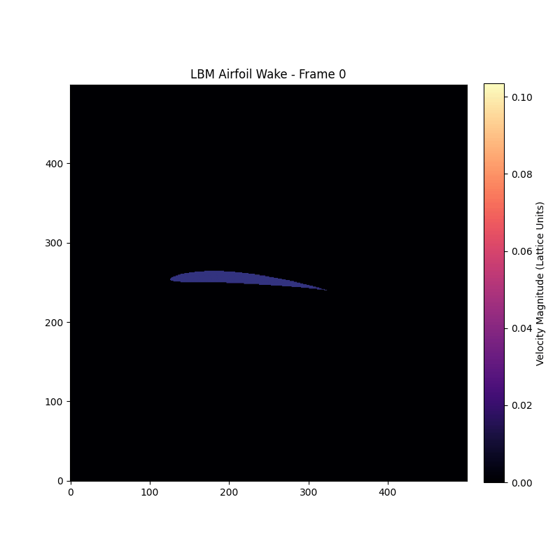

# fluid-sim

<div align="left">


</div>

A fast C++ fluid simulation designed specifically to learn the parallelisation process on HPCs




## Physics
___
This is a fluid simulation that makes use of the Lattice Boltzmann Method (LBM). This differs from trying to solve the complex Navier-Stokes equations because instead, it models the fluid as a collection of particles residing on a strict grid (the lattice). During every time step, the simulation performs two highly parallelizable actions: Streaming (moving to adjacent grid cells) and Colliding (relaxing towards some equilibrium state). If we then look at the macroscopic level, these simple rules naturally create the beautiful, chaotic movements of the fluid traveling across an airfoil.


## Instructions and initial set-up
___
```Bash
# Create, activate and install requirements to a virtual environment

python -m venv venv
source venv/bin/activate
pip install -r requirements.txt
deactivate

# Then you need to build the C++ file, for CPU or GPU.
make cpu/gpu

# Use the job_cpu/gpu to run the code
sbatch job_cpu/gpu

# You can then sftp/scp the GIF onto your sytem to view it
```
## Troubleshooting
___
**Issue:** `python: command not found` when running job scripts

**Cause:** HPC compute nodes typically only have `python3`, not `python`.

**Fix:** If you encounter this error, run:
```bash
rm venv/bin/python venv/bin/python3 venv/bin/python3.10
ln -s /usr/bin/python3 venv/bin/python
ln -s python venv/bin/python3
ln -s python venv/bin/python3.10
source venv/bin/activate
pip install -r requirements.txt
deactivate
```

## Acknowledgments
___
I am extreamly grateful to the following article for distilling the conceptually difficult concepts of the LBM method into a clear computational approach:

[Implementation of the Lattice Boltzmann Method](https://feaforall.com/implementation-lattice-boltzmann-method-lbm/) by FEA for All.
